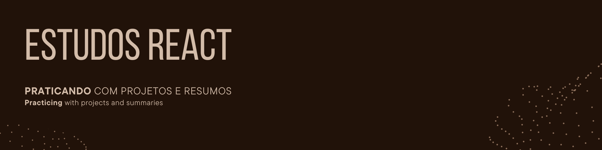

## 🚀 Visão Geral

Bem-vindo ao meu repositório de estudos em React.js! Este repositório é dedicado a vários projetos que concluí para aprimorar minhas habilidades em React.js e tecnologias relacionadas. Cada pasta contém um projeto diferente que demonstra várias funcionalidades e conceitos.
[README PT-BR](README.md) | [README EN](README_en.md)

## 📁 Projetos

### 1. 🛡️ Sistema de Controle de Usuários
- **Tecnologias:** React, Laravel
- **Descrição:** Um sistema simples para controle de usuários com cadastro, login e um dashboard exibindo informações dos usuários.
- **Funcionalidades:**
  - React Router para navegação
  - Context API para gerenciamento de estado
  - Múltiplos layouts baseados nos níveis de permissão do usuário
  - Funcionalidade de login e logout de usuários
  - Operações CRUD para gerenciamento de usuários
